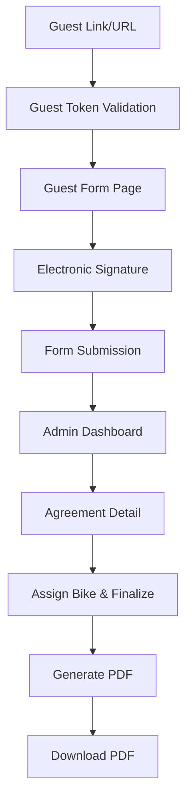

## 1. Product Overview
Digital rental agreement system to replace paper workflow for SriRentABike service. Streamlines tourist bike rental agreements with mobile-first design and professional PDF generation.
- Solves manual paperwork inefficiency, reduces processing time by 80%+
- Target users: Tourists renting bikes, SriRentABike admin staff
- Market value: Operational efficiency, professional service delivery, digital transformation

## 2. Core Features

### 2.1 User Roles
| Role | Registration Method | Core Permissions |
|------|---------------------|------------------|
| Tourist | Guest access via unique link | Fill rental form, electronic signature, submit agreement |
| Admin | Email/password login | View agreements, assign bikes, generate PDFs, manage system |

### 2.2 Feature Module
Our rental agreement system consists of the following main pages:
1. **Guest Form Page**: Rental agreement form, electronic signature pad, form submission
2. **Admin Login Page**: Secure authentication for admin access
3. **Admin Dashboard**: Agreements list, search/filter, status management
4. **Agreement Detail Page**: Review submissions, assign bikes, finalize agreements
5. **PDF Generation**: Professional A4 PDF output matching original format

### 2.3 Page Details
| Page Name | Module Name | Feature description |
|-----------|-------------|---------------------|
| Guest Form Page | Rental Form | Fill tourist details (name, passport, nationality, contact, hotel), vehicle information, rental period, rates, deposit amount |
| Guest Form Page | Electronic Signature | Touchscreen-friendly signature pad with clear signing area, save signature as PNG |
| Guest Form Page | Form Submission | Validate all fields, generate unique agreement ID, store submission data |
| Admin Login Page | Authentication | Email/password login with JWT tokens, secure session management |
| Admin Dashboard | Agreements List | Display all agreements with status (pending/signed/completed), show key details (name, date, plate number) |
| Admin Dashboard | Search & Filter | Search by tourist name, filter by date range, status, bike plate number |
| Agreement Detail Page | Review Submission | View complete tourist information, rental details, signature image |
| Agreement Detail Page | Bike Assignment | Select available bike from inventory, assign frame number, plate number |
| Agreement Detail Page | Finalize Agreement | Set rental dates, confirm rates, update status to completed |
| PDF Generation | Template Rendering | Generate professional A4 PDF matching original layout, auto-populate all fields, embed signatures |

## 3. Core Process
**Tourist Flow**: Receive guest link → Fill rental form → Sign electronically → Submit → Receive confirmation
**Admin Flow**: Login → View dashboard → Select agreement → Review details → Assign bike → Generate PDF → Download

## 4. User Interface Design

### 4.1 Design Style
- **Primary Colors**: Professional blue (#2563eb), white background, black text
- **Secondary Colors**: Success green (#10b981), warning amber (#f59e0b)
- **Button Style**: Rounded corners, clear hover states, mobile-optimized touch targets
- **Font**: System fonts for fast loading, 16px base size, clear hierarchy
- **Layout**: Card-based design, single-column mobile layout, responsive grid for desktop
- **Icons**: Clean line icons, intuitive symbols for actions

### 4.2 Page Design Overview
| Page Name | Module Name | UI Elements |
|-----------|-------------|-------------|
| Guest Form Page | Rental Form | Single-column mobile layout, large input fields, clear section headers, progress indicator, sticky submit button |
| Guest Form Page | Signature Pad | Full-width signature area, clear canvas with border, undo/clear buttons, submit confirmation |
| Admin Dashboard | Agreements List | Clean table with status badges, search bar at top, filter dropdowns, pagination for large datasets |
| Agreement Detail Page | Review Section | Two-column layout on desktop, stacked on mobile, clear section dividers, action buttons at bottom |

### 4.3 Responsiveness
Mobile-first design approach with responsive breakpoints. Touch-optimized interactions, large tap targets, swipe-friendly navigation. Desktop layout expands to utilize available screen space effectively.

### 4.4 PDF Template Guidance
Professional A4 layout matching original rental agreement format. Clean typography, proper spacing, professional appearance suitable for legal documentation. Include all form fields, signatures, and company branding.

Prerequisites for PDF generation:
- Agreement must have a captured signature
- A bike must be assigned to the agreement
