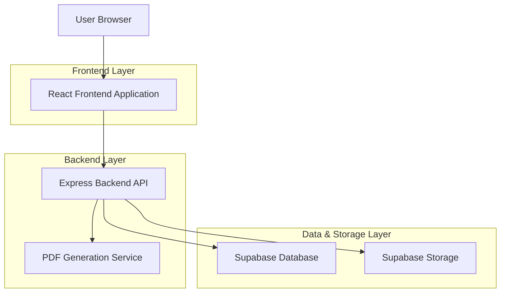
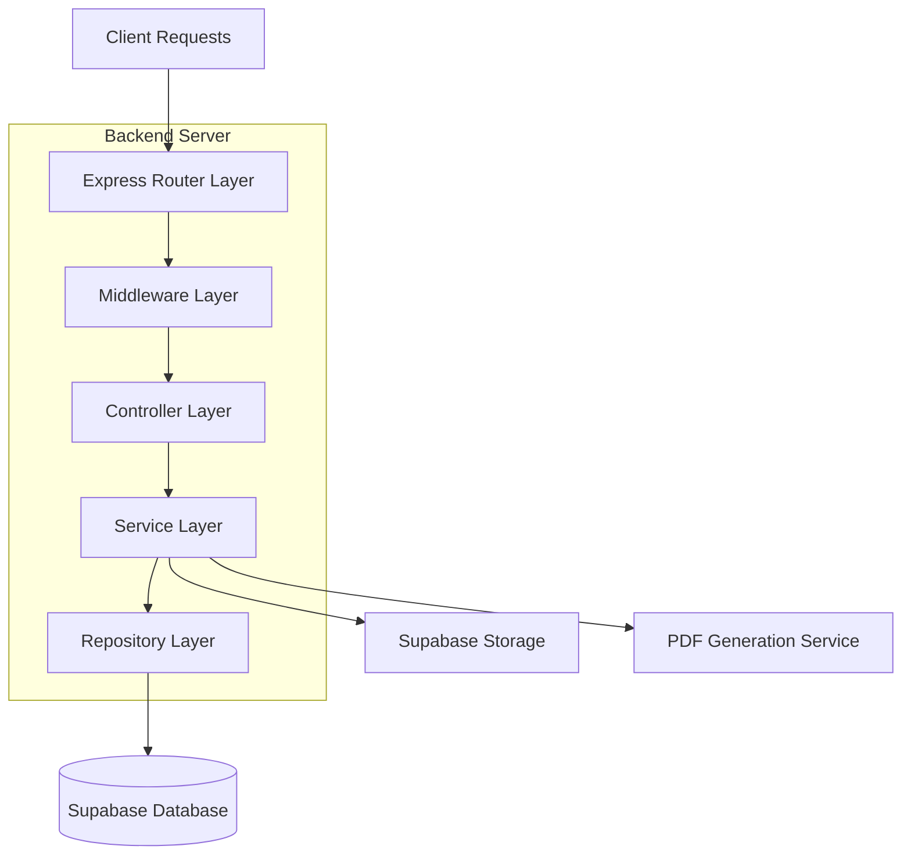
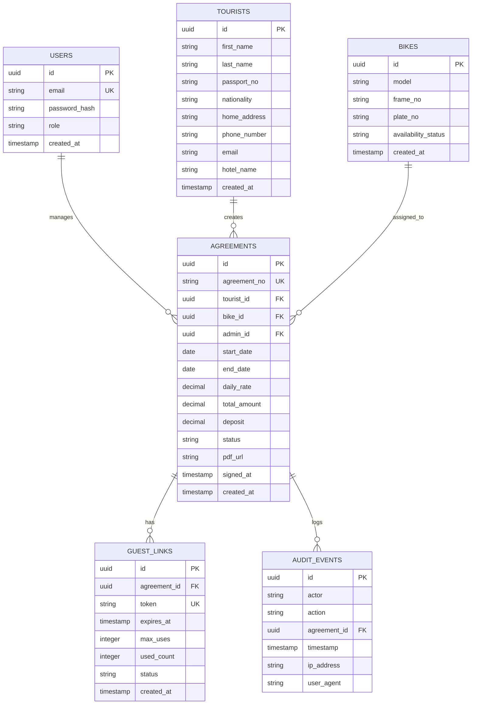

## 1. Architecture design



## 2. Technology Description
- Frontend: React@18 + TypeScript + Vite + Tailwind CSS
- Initialization Tool: Vite
- Backend: Node.js + Express@4 + TypeScript
- Database: Supabase PostgreSQL
- Storage: Supabase Storage
- PDF Generation: Puppeteer + HTML templates
- Authentication: JWT for admin, signed tokens for guest links

## 3. Route definitions
| Route | Purpose |
|-------|---------|
| / | Guest form landing page |
| /form/:token | Rental agreement form with guest token |
| /admin/login | Admin authentication page |
| /admin/dashboard | Admin dashboard with agreements list |
| /admin/agreements/:id | Agreement detail and management page |
| /api/agreements | CRUD operations for agreements |
| /api/agreements/public/:reference | Public agreement status by reference |
| /api/auth/* | Authentication endpoints |
| /api/guest-links | Guest link generation and validation |
| /api/pdf/generate/:agreementId | PDF generation endpoint (admin) |
| /api/pdf/download/:agreementId | PDF download endpoint (admin) |
| /api/pdf/url/:agreementId | PDF URL (preview) endpoint (admin) |
| /api/bikes | Bike inventory endpoints (admin) |
| /api/bikes/available | List available bikes (admin) |
| /api/bikes/:id | Update/delete bike (admin) |
| /api/bikes/:id/archive | Archive a bike (admin) |
| /api/bikes/:id/meta | Get/put bike metadata (admin) |
| /api/bikes/:id/docs | Upload/list bike documentation (admin) |
| /api/health | Backend health check |

## 4. API definitions

### 4.1 Authentication APIs

**Admin Login**
```
POST /api/auth/admin/login
```

Request:
| Param Name | Param Type | isRequired | Description |
|------------|------------|------------|-------------|
| email | string | true | Admin email address |
| password | string | true | Admin password |

Response:
| Param Name | Param Type | Description |
|------------|------------|-------------|
| token | string | JWT access token |
| user | object | Admin user data |
|
**Current User**
```
GET /api/auth/me
```

**Setup Admin (development)**
```
POST /api/auth/setup-admin
```

### 4.2 Agreement APIs

**Create Agreement**
```
POST /api/agreements
```

Request:
| Param Name | Param Type | isRequired | Description |
|------------|------------|------------|-------------|
| tourist_data | object | true | Tourist information (name, passport, nationality, etc.) |
| signature | string | true | Base64 encoded signature image |

Response:
| Param Name | Param Type | Description |
|------------|------------|-------------|
| agreement_id | string | Unique agreement identifier |
| status | string | Agreement status (pending) |

**Update Agreement (Admin)**
```
PUT /api/agreements/:id
```

Request:
| Param Name | Param Type | isRequired | Description |
|------------|------------|------------|-------------|
| bike_id | string | false | Assigned bike ID |
| start_date | string | false | Rental start date |
| end_date | string | false | Rental end date |
| status | string | false | Agreement status |
|
**Public Agreement Status**
```
GET /api/agreements/public/:reference
```

### 4.3 PDF APIs

**Generate PDF (Admin)**
```
POST /api/pdf/generate/:agreementId
```

**Download PDF (Admin)**
```
GET /api/pdf/download/:agreementId
```

**Get PDF URL (Admin)**
```
GET /api/pdf/url/:agreementId
```

### 4.4 Guest Link APIs

**Validate Guest Token**
```
GET /api/guest-links/validate/:token
```

Response:
| Param Name | Param Type | Description |
|------------|------------|-------------|
| valid | boolean | Token validity status |
| agreement_id | string | Associated agreement ID |
| expires_at | string | Token expiration timestamp |

## 5. Server architecture diagram



## 6. Data model

### 6.1 Data model definition



### 6.2 Data Definition Language

**Users Table**
```sql
CREATE TABLE users (
    id UUID PRIMARY KEY DEFAULT gen_random_uuid(),
    email VARCHAR(255) UNIQUE NOT NULL,
    password_hash VARCHAR(255) NOT NULL,
    role VARCHAR(50) DEFAULT 'admin' CHECK (role IN ('admin')),
    created_at TIMESTAMP WITH TIME ZONE DEFAULT NOW()
);

-- Grant permissions
GRANT SELECT ON users TO anon;
GRANT ALL PRIVILEGES ON users TO authenticated;
```

**Tourists Table**
```sql
CREATE TABLE tourists (
    id UUID PRIMARY KEY DEFAULT gen_random_uuid(),
    first_name VARCHAR(100) NOT NULL,
    last_name VARCHAR(100) NOT NULL,
    passport_no VARCHAR(50) NOT NULL,
    nationality VARCHAR(100) NOT NULL,
    home_address TEXT NOT NULL,
    phone_number VARCHAR(20) NOT NULL,
    email VARCHAR(255) NOT NULL,
    hotel_name VARCHAR(255),
    created_at TIMESTAMP WITH TIME ZONE DEFAULT NOW()
);

-- Grant permissions
GRANT SELECT ON tourists TO anon;
GRANT ALL PRIVILEGES ON tourists TO authenticated;
```

**Bikes Table**
```sql
CREATE TABLE bikes (
    id UUID PRIMARY KEY DEFAULT gen_random_uuid(),
    model VARCHAR(100) NOT NULL,
    frame_no VARCHAR(100) UNIQUE NOT NULL,
    plate_no VARCHAR(20) UNIQUE NOT NULL,
    availability_status VARCHAR(20) DEFAULT 'available' CHECK (availability_status IN ('available', 'rented', 'maintenance')),
    created_at TIMESTAMP WITH TIME ZONE DEFAULT NOW()
);

-- Grant permissions
GRANT SELECT ON bikes TO anon;
GRANT ALL PRIVILEGES ON bikes TO authenticated;
```

**Agreements Table**
```sql
CREATE TABLE agreements (
    id UUID PRIMARY KEY DEFAULT gen_random_uuid(),
    agreement_no VARCHAR(50) UNIQUE NOT NULL,
    tourist_id UUID REFERENCES tourists(id),
    bike_id UUID REFERENCES bikes(id),
    admin_id UUID REFERENCES users(id),
    start_date DATE NOT NULL,
    end_date DATE NOT NULL,
    daily_rate DECIMAL(10,2) NOT NULL,
    total_amount DECIMAL(10,2) NOT NULL,
    deposit DECIMAL(10,2) NOT NULL,
    status VARCHAR(20) DEFAULT 'pending' CHECK (status IN ('pending', 'signed', 'completed')),
    pdf_url TEXT,
    signature_url TEXT,
    pdf_status VARCHAR(20) DEFAULT 'none' CHECK (pdf_status IN ('none','generated','downloaded')),
    updated_at TIMESTAMP WITH TIME ZONE,
    deleted_at TIMESTAMP WITH TIME ZONE,
    signed_at TIMESTAMP WITH TIME ZONE,
    created_at TIMESTAMP WITH TIME ZONE DEFAULT NOW()
);

-- Grant permissions
GRANT SELECT ON agreements TO anon;
GRANT ALL PRIVILEGES ON agreements TO authenticated;
```

**Guest Links Table**
```sql
CREATE TABLE guest_links (
    id UUID PRIMARY KEY DEFAULT gen_random_uuid(),
    agreement_id UUID REFERENCES agreements(id),
    token VARCHAR(255) UNIQUE NOT NULL,
    expires_at TIMESTAMP WITH TIME ZONE NOT NULL,
    max_uses INTEGER DEFAULT 1,
    used_count INTEGER DEFAULT 0,
    status VARCHAR(20) DEFAULT 'active' CHECK (status IN ('active', 'expired', 'used')),
    created_at TIMESTAMP WITH TIME ZONE DEFAULT NOW()
);

-- Grant permissions
GRANT SELECT ON guest_links TO anon;
GRANT ALL PRIVILEGES ON guest_links TO authenticated;
```

**Audit Events Table**
```sql
CREATE TABLE audit_events (
    id UUID PRIMARY KEY DEFAULT gen_random_uuid(),
    actor VARCHAR(100) NOT NULL,
    action VARCHAR(100) NOT NULL,
    agreement_id UUID REFERENCES agreements(id),
    timestamp TIMESTAMP WITH TIME ZONE DEFAULT NOW(),
    ip_address INET,
    user_agent TEXT
);

-- Grant permissions
GRANT SELECT ON audit_events TO anon;
GRANT ALL PRIVILEGES ON audit_events TO authenticated;
```
